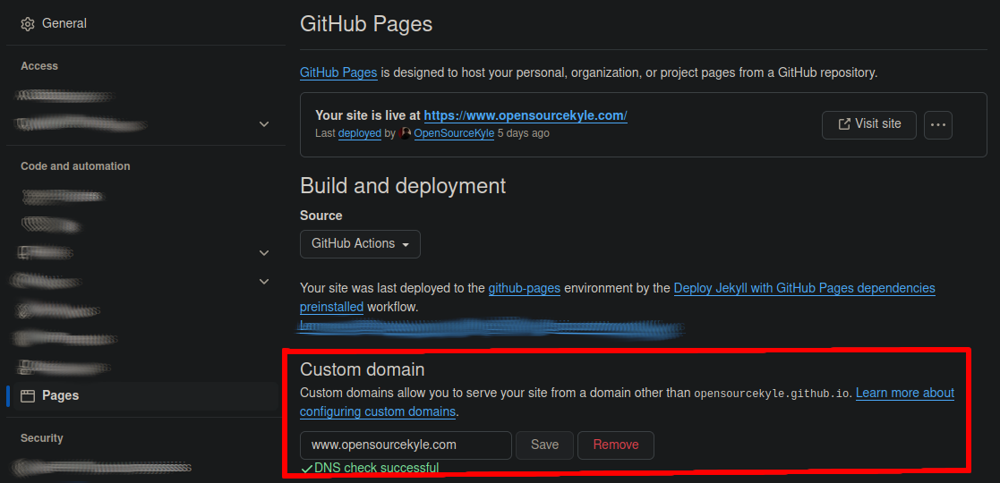
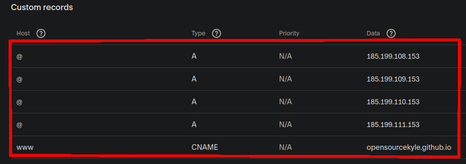

# OpenSourceKyle

[](https://creativecommons.org/licenses/by-nc/4.0/)

**OpenSourceKyle** is a collection of my personal writings. These are not definitive or absolute expressions of my beliefs but reflections of my thoughts at a given time. Writing helps me manage anxiety and obsessive thinking, and this space allows me to process and refine my thoughts. Some content may be **incomplete, controversial, or mistaken**, but the goal is to document my thinking as it evolves, not to wait for perfection.

---

## Installation

### Remote

The site is built and deployed via GitHub Actions: [](https://github.com/OpenSourceKyle/OpenSourceKyle.github.io/actions/workflows/build-and-check-website.yml)

### Local (Arch Linux)

Follow these steps to run the project locally:

- Install Hugo: [Hugo Documentation](https://gohugo.io/documentation/)
- Theme setup: [My Custom Theme](https://github.com/OpenSourceKyle/hugo-opensourcekyle-theme)

```bash
# Install Hugo (Arch Linux includes the extended version)
sudo pacman -S hugo

# Clone repo with submodules
git clone --recurse-submodules git@github.com:OpenSourceKyle/OpenSourceKyle.github.io.git \
&& cd OpenSourceKyle.github.io && ./setup.sh

# Serve the site locally and auto-rebuild on changes
hugo server
```

---

## Configuration

### Hosting: GitHub Pages

For deployment details, see the clickable badge above.

Reference: [GitHub Pages Documentation](https://docs.github.com/en/pages)

### DNS: Squarespace

To configure DNS with GitHub Pages and your domain, follow these steps:

#### Step 1: GitHub Pages Setup

Add your custom domain (`www.opensourcekyle.com`) in the [GitHub Pages settings](https://github.com/OpenSourceKyle/OpenSourceKyle.github.io/settings/pages).



#### Step 2: Squarespace DNS Setup

Configure 5 DNS records in [Squarespace DNS settings](https://account.squarespace.com/domains/managed/opensourcekyle.com/dns/dns-settings).


