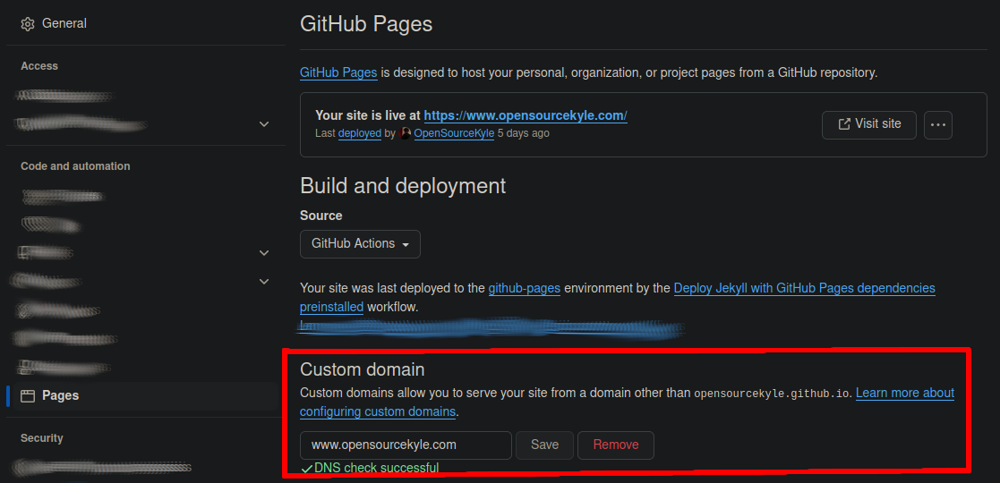
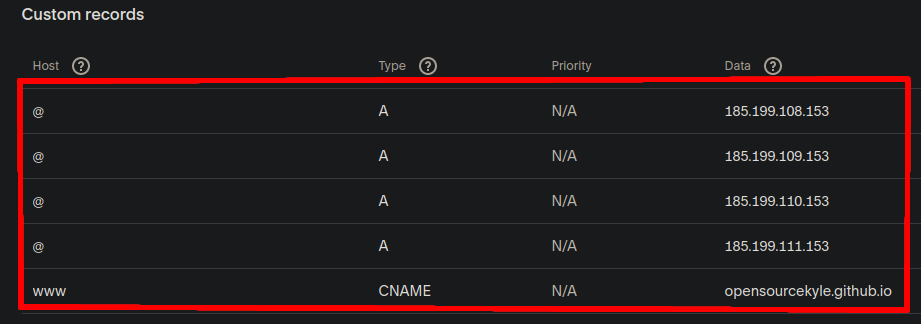

# OpenSourceKyle

OpenSourceKyle is collection of my writings. These are not meant to descriptive and absolute in my beliefs, BUT they are meant to be my thoughts written out. Writing out my thoughts has helped with my anxious, obsessive way of thinking. I note this because **these writings could be wrong or controversial** among many other things. My goal is to give myself a place to flesh out my thinking better instead of waiting for the thoughts to be perfect.

# Installation

## Remote

Built via Github Actions: [](https://github.com/OpenSourceKyle/OpenSourceKyle.github.io/actions/workflows/jekyll-gh-pages.yml)

## Local (Arch Linux + zsh)

The following instructions detail how to get started:

* <https://jekyllrb.com/docs/installation/other-linux/#archlinux>
* <https://jekyllrb.com/docs/#instructions>

```shell
# Install pkgs: Arch Linux
sudo pacman -S ruby base-devel

# Add gem binaries to $PATH
echo '
export GEM_HOME=$HOME/.gem
export PATH=$GEM_HOME/ruby/3.0.0/bin:$PATH
' >> ~/.zshrc
source ~/.zshrc

# Install Jekyll & Bundler
gem install jekyll bundler

# Automatically rebuild/serve website while editing
bundler exec jekyll serve --livereload --incremental
```

# Configuration

## Hosting: GitHub Pages

* Reference: <https://docs.github.com/en/pages>

GitHub Actions generates and deploys the website. Check the clickable badge above for more information.

## DNS: Squarespace

* Reference: <https://docs.github.com/en/pages/configuring-a-custom-domain-for-your-github-pages-site/managing-a-custom-domain-for-your-github-pages-site>

To configure DNS to work with the domain there are 2 steps.

### Step 1

From the GitHub Pages settings page <https://github.com/OpenSourceKyle/OpenSourceKyle.github.io/settings/pages>, add the domain `www.opensourcekyle.com` to the "Custom Domain" section as seen below.



### Step 2

From the Squarespace DNS setting page <https://account.squarespace.com/domains/managed/opensourcekyle.com/dns/dns-settings>, add 5 records in total as seen below.



# Writings

The writings will use tags to sort content in the site automatically.

At this time, there are 2 meta-categories in `_posts`:

### Blog/Journal/Diary Section:

* `_posts/journals`:
  * or post, blog, diary, etc. generally these do not need images are written for my own personal benefit (and not to be useful directly)


##### Valid Tags

- journal

### Pages (how-tos)

* `_posts/pages`:
  * these are meant to be consumable, from my own perspective and experience, but accompanied with images and links

##### Valid Tags

- internal
- love
- fitness
- diet
- improvement
- socialize